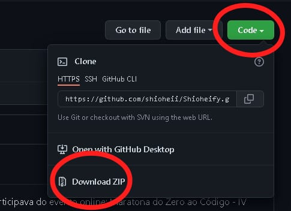

# Projeto Shioheify
<a href="https://github.com/shioheii">
  
</a>
<a href="#">
  
</a>
<a href="#">
  
</a>
<a href="#">
  
</a>
<a href="#">
  
</a><br />

O projeto Shioheify foi desenvolvido por mim, enquanto participava do evento online: Maratona do Zero ao Código - IV Edição, realizado pela [Kenzie Academy](https://kenzie.com.br/).

## Sobre o projeto:
A proposta do projeto era desenvolver uma interface inspirada no [Spotify](https://www.spotify.com/br/), onde poderíamos ouvir as músicas que colocamos no site. Como eu nunca havia tido contato com o front-end de uma forma mais direta, fui fazendo passo a passo, conforme os professores iam avançando no projeto, me atentando aos novos conceitos.

## O que aprendi?
- Diferentes tags e para que servem no HTML
- Como estruturar meu código no CSS
- Anatomia do CSS (seletor, propriedade, valor)
- Como estruturar um código JavaScript
- Variáveis, condicionais, loops e funções em JavaScript

## Linguagens utilizadas:
- HTML
- CSS
- JavaScript

## Ferramenta utilizada:
- [Visual Studio Code](https://code.visualstudio.com/)

## Adicionar músicas
Para adicionar novas músicas ao site, basta colocar os arquivos .mp3 na pasta "audio" (scr/audio) e a imagem do álbum na pasta "img" (scr/img).
Após isso, é só criar mais um espaço no array "baseMusicas" com todas as informações, e o programa já irá adicioná-lo.

## Executar projeto:
Para executar este projeto no seu computador, basta clicar em "Code" e depois em "Download ZIP":


Ou clone o repositório pelo link:
```bash
$ git https://github.com/shioheii/Shioheify.git
```
Então abra a página "index.html" no navegador.

---

<p align="center">
  <a alt="Bruno Shiohei Kinoshita do Nascimento Linkedin" href="https://www.linkedin.com/in/bruno-shiohei-24b27621a/">
    
  </a>
  <a alt="Bruno Shiohei Kinoshita do Nascimento GitHub" href="https://github.com/shioheii">
    
  </a>
</p>
